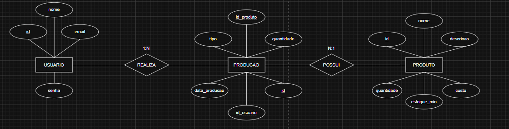

# Avaliação – Sistema de Gestão de Produção e Estoque

Esta atividade tem como finalidade desenvolver um **sistema Web Full Stack** voltado para o gerenciamento da produção e do estoque de produtos fabricados em MDF.

O sistema deve realizar o cadastro e gerenciamento dos produtos, acompanhar o estoque, registrar pedidos e controlar os produtos produzidos. A proposta utiliza o conceito de **Just in Time**, mantendo um estoque mínimo e buscando produzir conforme a necessidade e a demanda, evitando desperdícios.

O projeto também envolve as etapas de **levantamento e análise de requisitos, modelagem do banco de dados, desenvolvimento do sistema, realização de testes e elaboração da documentação**.
#

# Objetivo
Desenvolver um sistema que ajude um fabricante de produtos em MDF no controle de sua produção e estoque.

O sistema deve:

- Cadastro de produtos;
- Consulta, edição e exclusão de produtos;
- Controle da quantidade em estoque;
- Definição de estoque mínimo;
- Registro de produtos fabricados;
- Registro de pedidos e saídas de estoque;
- Identificação do usuário responsável por cada ação;
- Alertas quando o estoque estiver abaixo do mínimo;
- Acompanhamento das movimentações de produção e pedidos.
#

# Lista de Requisitos Funcionais
**RF01 — Interface de Autenticação**

* **[RF01.1]** Exibir a interface de autenticação do sistema.
* **[RF01.2]** Solicitar o e-mail do usuário.
* **[RF01.3]** Solicitar a senha do usuário.
* **[RF01.4]** Validar o e-mail e a senha informados com os dados cadastrados no banco de dados.
* **[RF01.5]** Redirecionar o usuário autenticado para a interface principal do sistema.
* **[RF01.6]** Informar ao usuário quando as credenciais informadas forem inválidas.
* **[RF01.7]** Permitir que o usuário tente realizar a autenticação novamente após uma falha.

**RF02 — Interface Principal do Sistema**

* **[RF02.1]** Exibir o nome do usuário autenticado.
* **[RF02.2]** Disponibilizar acesso à interface de Cadastro de Produto.
* **[RF02.3]** Disponibilizar acesso à interface de Gestão de Produção (Just in Time).
* **[RF02.4]** Disponibilizar uma opção para realizar logout.
* **[RF02.5]** Redirecionar o usuário para a interface de autenticação após o logout.

**RF03 — Cadastro de Produto**

* **[RF03.1]** Listar automaticamente os produtos cadastrados no banco de dados ao acessar a interface.
* **[RF03.2]** Exibir os dados dos produtos cadastrados em uma tabela.
* **[RF03.3]** Disponibilizar um campo de busca de produtos.
* **[RF03.4]** Permitir o cadastro de um novo produto.
* **[RF03.5]** Permitir a exclusão de um produto existente.
* **[RF03.6]** Permitir o preenchimento da descrição do produto.
* **[RF03.7]** Permitir o preenchimento do custo do produto.
* **[RF03.8]** Permitir o preenchimento da quantidade em estoque.
* **[RF03.9]** Permitir o preenchimento da quantidade mínima de estoque.
* **[RF03.10]** Informar ao usuário quando houver ausência ou inserção inválida de dados.

**RF04 — Gestão de Produção (Just in Time)**

* **[RF04.1]** Listar produtos cadastrados em ordem alfabética.
* **[RF04.2]** Selecionar produto para movimentação de estoque (pedido ou fabricação).
* **[RF04.3]** Inserir dados da nova movimentação (entrada ou saída).
* **[RF04.4]** Atualizar automaticamente a quantidade em estoque.
* **[RF04.16]** Exibir um alerta ao usuário quando o estoque estiver abaixo do estoque mínimo.
* **[RF04.17]** Impedir movimentações de saída que resultem em estoque negativo.

**RF05 — Controle de Acesso**

* **[RF05.1]** Registrar cada usuário realizando ação (cadastro, edição, exclusão, movimentação de estoque).
* **[RF05.2]** Permitir consulta ao histórico de ações realizadas.
* **[RF05.3]** Encerrar a sessão do usuário ao realizar logout.
#

# Diagrama (DER)


# Interface de Autenticação

O sistema deve ter uma interface de login para a autenticação dos usuários.
Funcionalidades:
- Campo para informar o e-mail;
- Campo para informar a senha;
- Validação das credenciais;
- Mensagem informando o motivo da falha de autenticação;
- Redirecionamento para a tela principal após o login realizado com sucesso;
- Retorno à tela de login quando a autenticação falhar.
#

#  Interface Principal
Responsável por centralizar o acesso às funcionalidades do sistema.

Ela deverá:

- Exibir o nome do usuário autenticado;
- Possuir uma opção de logout;
- Permitir acesso ao cadastro de produtos;
- Permitir acesso à gestão de produção;
- Possuir um layout organizado e adequado ao sistema.
#


# Interface de Cadastro de Produto
Deve permitir o gerenciamento dos produtos armazenados no banco de dados.

Cada produto deve ter informações relacionadas ao seu gerenciamento, como:

- Nome;
- Descrição;
- Custo;
- Quantidade em estoque;
- Estoque mínimo.

**Funcionalidades:**

- Listagem automática dos produtos;
- Exibição dos dados em uma tabela;
- Busca de produtos;
- Cadastro de novos produtos;
- Edição de produtos;
- Exclusão de produtos;
- Validação dos campos;
- Alertas para informações inválidas ou não preenchidas;
- Retorno à interface principal.
#

# Interface de Gestão de Produção
### Gestão de Produção (Just in Time)

* **Controle de estoque:** permitir o registro e acompanhamento das movimentações de entrada e saída dos produtos.
* **Ordenação dos produtos:** apresentar os produtos em ordem alfabética utilizando um algoritmo de ordenação.
* **Seleção do produto:** permitir que o usuário selecione o produto que deseja movimentar.
* **Tipo de movimentação:** disponibilizar as opções:

  * **Fabricado:** representa uma entrada de produtos no estoque.

    * Estoque atual + quantidade fabricada.
  * **Pedido:** representa uma saída de produtos do estoque.

    * Estoque atual − quantidade solicitada.
* **Atualização do estoque:** atualizar automaticamente a quantidade em estoque após cada movimentação.
* **Verificação do estoque mínimo:** verificar automaticamente se o estoque ficou abaixo do limite mínimo configurado.
* **Alerta:** exibir um alerta ao usuário quando o estoque estiver abaixo do mínimo.
* **Registro de movimentação:** armazenar qual usuário realizou cada movimentação.
#

# Documentação de Requisitos no Word
Toda a documentação detalhada do sistema está disponível na [documentação completa](./frontend/docs/Mdf.pdf).

# Contexto

Um fabricante local de produtos em MDF enfrenta dificuldades no controle da produção devido à falta de um sistema informatizado.

Atualmente, os pedidos são realizados de forma manual, o que pode gerar atrasos, erros e dificuldades no acompanhamento das necessidades dos clientes e revendedores.

Como solução, será desenvolvido um sistema de gerenciamento baseado no conceito de **Just in Time**, permitindo manter um estoque mínimo e realizar a produção conforme a demanda.

O sistema terá como objetivo centralizar as informações de produtos, pedidos, produção e estoque, proporcionando maior organização, controle e facilidade no acompanhamento das movimentações.


#  Lista de Verificação por Atividade

## ATIVIDADE 1 – Documentação de Requisitos
| Evidência | Capacidade | Peso | Sim | Não |
|-----------|------------|------|-----|-----|
| Desenvolveu conforme análise de requisitos | C6 | 2 | ✅ |  |
| Modelo de requisitos funcionais mínimos | C6 | 2 | ✅ |  |

## ATIVIDADE 2 – DER
| Evidência | Capacidade | Peso | Sim | Não |
|-----------|------------|------|-----|-----|
| Chaves estrangeiras conforme modelagem | C4 | 2 | ✅ |  |
| Relações 1:N entre tabelas | C4 | 2 | ✅ |  |
| Tipos definidos corretamente (DATE, INT, etc.) | C4 | 2 | ✅ |  |
| Entidades Usuário, Produto e Produção | C4 | 1 | ✅ |  |

## ATIVIDADE 3 – Script Banco de Dados
| Evidência | Capacidade | Peso | Sim | Não |
|-----------|------------|------|-----|-----|
| Criou banco com nome especificado | C4 | 1 | ✅ |  |
| Criou todas as tabelas com chaves estrangeiras | C4 | 2 | ✅ |  |
| Inseriu registros de teste | C4 | 2 | ✅ |  |

## ATIVIDADE 4 – Interface Autenticação de Usuário
| Evidência | Capacidade | Peso | Sim | Não |
|-----------|------------|------|-----|-----|
| Criou sessão/localStorage para usuário autenticado | C7 | 2 | ✅ |  |
| Redireciona para interface principal após login | C7 | 3 | ✅ |  |
| Campos de login, senha e botão entrar | C7 | 2 | ✅ |  |
| Tratamento de falha de autenticação | C7 | 3 | ✅ |  |

## ATIVIDADE 5 – Interface Principal
| Evidência | Capacidade | Peso | Sim | Não |
|-----------|------------|------|-----|-----|
| Acesso ao cadastro de produto | C7 | 1 | ✅ |  |
| Acesso à gestão de produção | C7 | 1 | ✅ |  |
| Logout redireciona para login | C7 | 1 | ✅ |  |
| Exibe nome do usuário autenticado | C7 | 2 | ✅ |  |

## ATIVIDADE 6 – Interface Cadastro de Produto
| Evidência | Capacidade | Peso | Sim | Não |
|-----------|------------|------|-----|-----|
| Lista produtos ao carregar | C7 | 2 | ✅ |  |
| Inserção de novo produto | C7 | 2 | ✅ |  |
| Edição de produto existente | C7 | 3 | ✅ |  |
| Exclusão de produto existente | C7 | 2 | ✅ |  |
| Validação de dados | C7 | 3 | ✅ |  |
| Retorno à interface principal | C7 | 1 | ✅ |  |
| Campo de busca funcional | C7 | 3 | ✅ |  |

## ATIVIDADE 7 – Interface Gestão de Produção (Just in Time)
| Evidência | Capacidade | Peso | Sim | Não |
|-----------|------------|------|-----|-----|
| Seleção de produto e tipo (entrada/saída) | C7 | 2 | ✅ |  |
| Inserção de dados de transferência | C7 | 3 | ✅ |  |
| Lista em ordem alfabética | C7 | 3 |  | ❌ |
| Alerta de estoque mínimo | C7 | 3 | ✅ |  |

## ATIVIDADE 8 – Casos de Testes
| Evidência | Capacidade | Peso | Sim | Não |
|-----------|------------|------|-----|-----|
| Ferramentas e ambiente de testes descritos | C8 | 2 | ✅ |  |
| Casos de teste por requisito funcional | C8 | 2 | ✅ |  |
| Testes executados conforme casos | C8 | 2 | ✅ |  |

## ATIVIDADE 9 – Documentação de Infraestrutura
| Evidência | Capacidade | Peso | Sim | Não |
|-----------|------------|------|-----|-----|
| Linguagem e versão identificadas | C1 | 1 | ✅ |  |
| SGBD e versão identificados | C1 | 1 | ✅ |  |
| Sistema operacional e versão identificados | C1 | 1 | ✅ |  |
#
# Tecnologias utilizadas
```bash
Frontend: HTML, CSS e JavaScript
Backend: Node.js e Express
Banco de dados: MariaDB
ORM: Prisma
Testes de API: Insomnia
Navegador: Google Chrome
Editor de código: Visual Studio Code
```
#

# Objetivo da avaliação
Verificar a capacidade técnica de planejar, desenvolver, testar e documentar um sistema de informação simples, aplicando boas práticas de desenvolvimento de software.

O projeto tem as principais etapas do desenvolvimento de um sistema:

Análise de requisitos → Modelagem → Desenvolvimento → Testes → Documentação
